# Scenario

For speed restrictions, the SpeedManagement class is used which is inheritance being SituationRecord → OperatorAction → NetworkManagement → SpeedManagement.

# Representation in DATEX II

The diagram below depicts the major classes and attributes from the DATEX II model which should be chosen. The diagram also illustrates the more important optional classes and attributes which may be picked.

```mermaid
---
config:
  class:
    hideEmptyMembersBox: true
  theme: redux
---
classDiagram
  direction LR
  PayloadPublication <|-- SituationPublication
  SituationPublication *-- "0..*" Situation
  Situation *-- "1" HeaderInformation
  Situation *-- "1..*" SituationRecord
  SituationRecord *-- "1" Validity
  SituationRecord *-- "1" LocationReference
  LocationReference <|-- Location
  Location <|-- NetworkLocation
  NetworkLocation <|-- LinearLocation
  LinearLocation *-- OpenLrLinear
  OpenLrLinear *-- "1" olr1
  OpenLrLinear *-- "0..1" olr2
  olr1 *-- "1..*" olrp1
  olr1 *-- "1" olrp2
  Validity *-- "1" OverallPeriod
  SituationRecord <|-- OperatorAction
  OperatorAction <|-- NetworkManagement
  NetworkLocation *-- "0..1" SupplementaryPositionalDescription
  SupplementaryPositionalDescription "1" *-- "0..*" Carriageway
  Carriageway *-- "0..*" Lane
  NetworkManagement <|-- SpeedManagement

  class SituationRecord {
    +situationRecordCreationTime: DateTime
    +situationRecordVersionTime: DateTime
    +probabilityOfOccurence: ProbabilityOfOccurenceEnum
  }
  class OperatorAction {
    +operatorActionStatus: OperatorActionStatusEnum [0..1]
  }
  class SituationPublication {
  }
  class HeaderInformation {
    +informationStatus: informationStatusEnum
  }
  class NetworkManagement {
    +complianceOption: ComplianceOptionEnum
  }
  class Validity {
    +validityStatus: ValidityStatusEnum
  }
  class OverallPeriod {
    +overallEndTime: DateTime
    +overallStartTime: DateTime [0..1]
  }
  class SpeedManagement {
    +speedManagementType: SpeedManagementTypeEnum
    +temporaraySpeedLimit: KilometresPerHour
  }
  class Carriageway {
    +carriageway: CarriagewayEnum
    +originalNumberOfLanes: Integer [0..1]
  }
  class Lane {
    +laneNumber: Integer [0..1]
    +laneUsage: LaneEnum [0..1]
  }
  class olr1["OpenLrLineLocationReference"]
  class olr2["OpenLrLineLocationReference"]
  <<firstDirection>> olr1
  <<lastDirection>> olr2
  <<validityTimeSpecification>> OverallPeriod
  <<locationReference>>LinearLocation
  class olrp1["OpenLrPoint::OpenLrLocationReferencePoint"]
  class olrp2["OpenLrPoint::OpenLrLastLocationReferencePoint"]
  style SituationPublication fill:orange,stroke:black
  style Situation fill:orange,stroke:black
  style HeaderInformation fill:orange,stroke:black
  style Validity fill:orange,stroke:black
  style OverallPeriod fill:orange,stroke:black
  style SpeedManagement fill:orange,stroke:black
  style LinearLocation fill:orange,stroke:black
```

# Attributes

Attribute | Type | Mandatory | Values | Description
----------|------|-----------|--------|---------------
informationStatus | InformationStatusEnum | Yes | real securityExercise technicalExercise test | The status of the related information (real, test, exercise ....).
probabilityOfOccurence | ProbabilityOfOccurenceEnum | Yes | certain probable riskOf | An assessment of the degree of likelihood that the reported event will occur.
